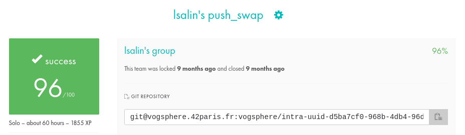

# push_swap

🇫🇷

Le projet push_swap est un défi d'algorithmie qui implique de trier des données dans une pile en utilisant un ensemble limité d’instructions.  
Le jeu se compose de deux piles, a et b, où a contient une série de nombres aléatoires non dupliqués et b est initialement vide.  
L'objectif est de trier les nombres dans la pile a dans l'ordre croissant en utilisant un certain nombre d'opérations spécifiées. 

Ces opérations incluent l'échange (swap), le déplacement (push), la rotation (rotate) et la rotation inverse (reverse rotate) qui peuvent être appliqués à l'une ou l'autre pile ou aux deux en même temps.

Le programme push_swap prend en paramètre la pile a sous la forme d'une liste d'entiers. Il doit alors afficher la séquence la plus courte d'instructions qui permettra de trier la pile a. L'efficacité du tri est jugée en fonction du nombre d'instructions utilisées.

__Comment tester le programme ?__
* Exécuter la commande “make” à la racine du répertoire
* Puis entrer une liste d’entiers à trier. Par exemple “./push_swap 1243 432 32”
* Le résultat correspond à la suite d’instructions permettant de trier le plus rapidement et efficacement la liste d’entiers donnée.

__Compétences acquises__ :
* Fonctionnement des listes chaînées
* Implémenter un algorithme de tri rapide et efficace

🇬🇧

The push_swap project is an algorithmic challenge that involves sorting data into a stack using a limited set of instructions.  
The game consists of two stacks, a and b, where a contains a series of non-duplicate random numbers and b is initially empty.  
The goal is to sort the numbers in stack a in ascending order using a number of specified operations.  
These operations include swap, push, rotate, and reverse rotate which can be applied to either stack or both at the same time.

The push_swap program takes as a parameter the stack a in the form of a list of integers. It must then display the shortest sequence of instructions which will make it possible to sort the stack a. Sorting efficiency is judged by the number of instructions used.

__How to test the program?__
* Execute the “make” command at the root of the directory
* Then enter a list of integers to sort. For example “./push_swap 1243 432 32”
* The result corresponds to the sequence of instructions allowing the fastest and most efficient sorting of the given list of integers.

__Acquired skills__ :
* Operation of linked lists
* Implement a fast and efficient sorting algorithm

